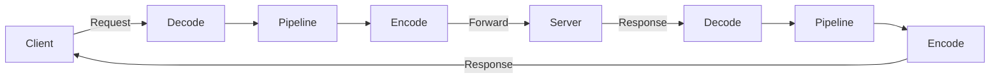

# ProtoTestTool


Protobuf 기반 TCP 패킷 테스트 도구. 클라이언트 모드와 프록시 모드를 지원하며, C# 스크립트를 통해 패킷 코덱/인터셉터를 런타임에 정의하고 핫 리로드할 수 있습니다.

---

## 주요 기능

### Test Client 모드
- TCP 서버에 직접 연결하여 Protobuf 패킷 송수신
- Monaco Editor 기반 JSON 편집기로 Request Body / Header 작성
- Response Inspector에서 수신 패킷의 Body와 Header 확인
- 패킷 검색 및 선택 UI (필터링 지원)

### Proxy 모드
- 로컬 포트에서 리슨하고 업스트림 서버로 포워딩하는 프록시
- Outbound (Client -> Server) / Inbound (Server -> Client) 양방향 인터셉터
- 패킷 수정, 드롭, 바이패스(재직렬화 생략) 지원
- `System.Threading.Channels` 기반 비동기 파이프라인으로 패킷 순서 보장

### 스크립트 시스템
- Roslyn 기반 C# 런타임 컴파일
- `UnloadableAssemblyContext`를 이용한 핫 리로드 (앱 재시작 불필요)
- Monaco Editor 기반 스크립트 편집기 (IntelliSense 지원)
- NuGet 패키지 검색 및 설치 (`Scripts/Libs/`에 자동 배치, 컴파일 시 자동 참조)

---

## 기술 스택

| 기술 | 용도 |
|------|------|
| .NET 9.0 / WPF | UI 프레임워크 |
| WPF-UI (Fluent) | Fluent Design 컨트롤 |
| WebView2 + Monaco Editor | 코드/JSON 편집기 |
| Roslyn | C# 스크립트 컴파일 |
| Google.Protobuf | 메시지 직렬화 |
| NetCoreServer | TCP 서버/클라이언트 |
| gRPC Tools (protoc) | .proto -> .cs 컴파일 |
| SQLite | 스크립트 상태 영속 저장 |

---

## 워크스페이스 구조

```
MyWorkspace/
├── workspace_config.json       # 연결 설정 (IP, 포트, 프록시 설정)
├── Script.dll                  # 스크립트 컴파일 결과 (자동 생성)
├── Protos.dll                  # 프로토 컴파일 결과 (자동 생성)
├── Protos/                     # .proto 소스 파일
├── Scripts/                    # C# 스크립트 소스
│   ├── PacketCodec.cs          # IPacketCodec 구현
│   ├── PacketRegistry.cs       # IPacketRegistry 구현
│   ├── PacketInterceptor.cs    # IPacketInterceptor 구현
│   ├── PacketHeader.cs         # IHeader 구현
│   ├── Libs/                   # NuGet 패키지 DLL
└── client_cache.db             # SQLite 상태 저장소
```

워크스페이스 선택 시 Mutex로 동일 워크스페이스의 다중 인스턴스 실행을 방지합니다.

---

## 스크립트 인터페이스

### IPacketCodec

TCP 바이트 스트림과 패킷 객체 간 변환을 담당합니다.

```csharp
public interface IPacketCodec
{
    int TryDecode(ref ReadOnlySpan<byte> buffer, out Packet? message);
    ReadOnlyMemory<byte> Encode(Packet packet);
}
```

### IPacketRegistry

패킷 ID와 메시지 타입 간 매핑을 정의합니다.

```csharp
public interface IPacketRegistry
{
    IEnumerable<Type> GetMessageTypes();
    Type? GetMessageType(int msgId);
    int GetMsgId(Type type);
    
    void RegisterMessageType(IReadOnlyList<Type> types);
    MessageParser GetParserById(int msgId); 
    
    // Request 패킷 목록 반환 (UI 표시용)
    IReadOnlyList<Type> GetMessageTypesRequest();
}
```

### IPacketInterceptor

프록시 모드(또는 클라이언트/리플레이)에서 패킷을 가로채 처리합니다.

```csharp
public interface IPacketInterceptor
{
    ValueTask OnInboundAsync(PacketContext context);   // Server -> Client
    ValueTask OnOutboundAsync(PacketContext context);  // Client -> Server
}
```

`PacketContext`를 통해 패킷 수정(`context.Packet`), 드롭(`context.Drop = true`), 바이패스(`context.Bypass = true`)가 가능합니다.

### IHeader

패킷 헤더의 직렬화를 정의합니다.

```csharp
public interface IHeader
{
    string ToJsonString();
}
```

### ScriptGlobals (정적 API)

스크립트에서 전역으로 접근할 수 있는 API입니다.

| API | 설명 |
|-----|------|
| `ScriptGlobals.State` | 인메모리 + SQLite 상태 저장소 |
| `ScriptGlobals.Log` | UI 로그 출력 (색상 지원) |
| `ScriptGlobals.Registry` | 패킷 레지스트리 (패킷 타입 정보) |
| `ScriptGlobals.Codec` | 패킷 코덱 (인코딩/디코딩) |

---

## 빌드 및 실행

```bash
dotnet build
dotnet run
```

### Publish

```bash
dotnet publish -c Release
```

`protoc.exe`와 Google proto includes가 publish 출력에 자동 포함됩니다.

---

## 프록시 패킷 처리 흐름



---

## 프리뷰

| | |
|:---:|:---:|
|  |  |
|  |  |
|  |  |
|  |  |
